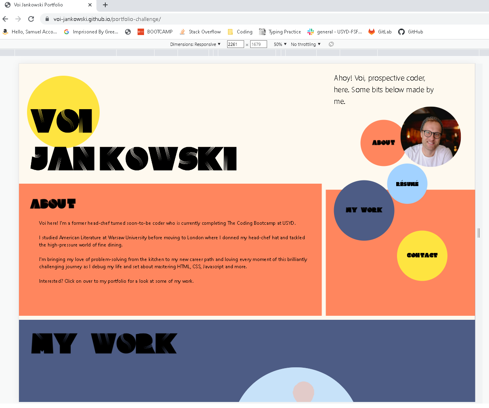
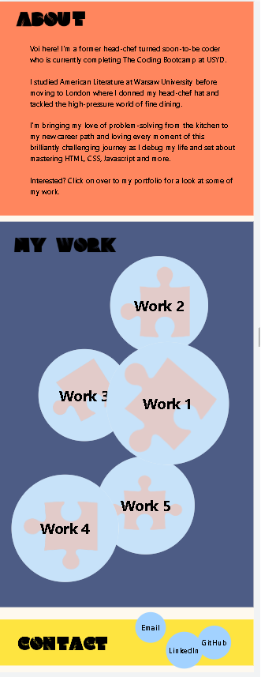
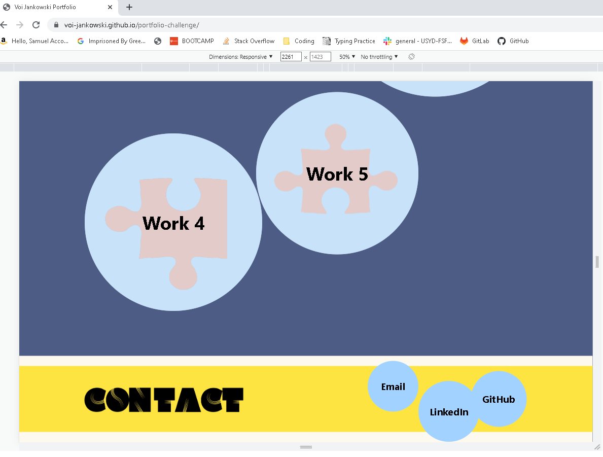

# Voi Jankowski Portfolio

## Project Description

The Portfolio has been created to showcase my work to potential employers, so they can have access to my work samples and contact details to reach out to me through different channels.

## Links

Have a look at my [live page](https://voi-jankowski.github.io/portfolio-challenge/) or visit the repository on [GitHub](https://github.com/voi-jankowski/portfolio-challenge)

## Usage

When you open the page you can find the navigation links inside the colourful bubbles next to my photo (right under the header if you are on a mobile or a tablet, or on the right if you are using a desktop). Click on any of them to be taken to the relevant part of the page. There is also a Resume link that takes you to the PDF file of my CV.

Below the About section you can find more bubbles containing images of my projects. The largest one is my latest project. Click on any of the links inside those bubbles to check out those live projects!

At the bottom of the page there's more bubbles! Those small ones in the Contact section are clickable too. They take you to my GitHub, LinkedIn or lets you send me an email.

## Credits

The colour pallet was sourced from [ColorHunt](https://colorhunt.co/palette/a2d2fffef9efff865efee440).

## License

Please refer to the LICENSE in the repo.
